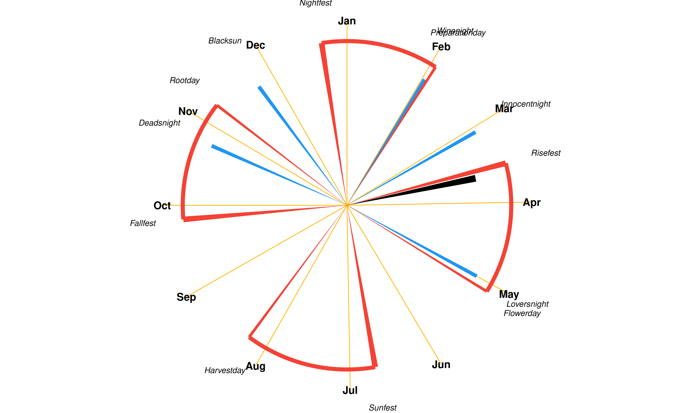

# Reality Bending Lab’s Calendar

We are in **Winter**. The **Dark Nights** are upon us, and we are in the
time of the **Rise**. The next celebration is
[**Winenight**](https://github.com/RealityBending/Calendar#Winenight) in
**28** days.

## Celebrations

In the Reality Bending Lab, we follow an astronomical calendar. The year
is divided in two main overlapping cycles, the **Rise/Fall** phases
(December - June) and the **Dark nights/Bright days** periods
(September - March).

*Note: this calendar is automatically updated daily thanks to an
automated R script that accounts for the exact dates of the solar and
lunar astronomical events (solstices, equinoxes, full moons) of the
current year.*

### Winenight

- **Fullmoon before Preparationday** *(2026 February 02 - Monday)*

Wine drinking. (See
[Anthesteria](https://en.wikipedia.org/wiki/Anthesteria)).

### Preparationday

- **Between Nightfest and Risefest** *(2026 February 03 - Tuesday)*

Ploughing and Sowing. Team building and planning of the work roadmap for
the year. (See [Imbolc](https://en.wikipedia.org/wiki/Imbolc)).

### Festival of the Innocents

- **Fullmoon before Preparationday** *(2026 March 03 - Tuesday)*

Masked party. Anonymity and roles. Wolves and sheep. Winter retreat.
(See [Lupercalia](https://en.wikipedia.org/wiki/Lupercalia) and
[Carnival of Venice](https://en.wikipedia.org/wiki/Carnival_of_Venice)).

### Risefest

- **Spring equinox** *(2026 March 18 - Wednesday)*

Coming of **Bright days** and **Spring**. Drowning of the *Winter Woman*
(See
[Marzanna](https://wpna.fm/polish-traditions-the-drowning-of-marzanna/)).
Eating eggs and water pranks.

### Loversnight

- **Fullmoon between Risefest and Sunfest** *(2026 May 01 - Friday
  night)*

Celebration of partners and loved ones. (see [Walpurgis’
Night](https://en.wikipedia.org/wiki/Walpurgis_Night) and
[Beltane](https://en.wikipedia.org/wiki/Beltane))

### Flowerday

- **Between Risefest and Sunfest** *(2026 May 04 - Monday)*

Celebration of life, youth and growth. Flowers in bloom and celebrations
around the tree. (See [Floria](https://en.wikipedia.org/wiki/Floralia)
and [May Day](https://en.wikipedia.org/wiki/May_Day)).

### Sunfest

- **Summer solstice** *(2026 June 22 - Monday)*

Crackers and fireworks at sunset. Popcorns made in fires in the night.
(See [Kupala Night](https://en.wikipedia.org/wiki/Kupala_Night)).

### Harvestday

- **Between Sunfest and Fallfest** *(2026 August 08 - Saturday)*

We harvest the fruits of our work and relax. Work superiors treat to
dinner. Rewards and vacations. Start of summer break. (See
[Lughnasadh](https://en.wikipedia.org/wiki/Lughnasadh)).

### Fallfest

- **Autumn equinox** *(2026 September 26 - Saturday)*

Coming of the **Dark Nights** and **Autumn**. Beginning of the school
year. Fires are lit (no electricity).
[Wreaths](https://en.wikipedia.org/wiki/Do%C5%BCynki) symbolizing the
successful readiness for the year to come. (See
[Oktoberfest](https://en.wikipedia.org/wiki/Oktoberfest) and
[Thanksgiving](https://en.wikipedia.org/wiki/Thanksgiving)).

### Deadsnight

- **Fullmoon before Rootday** *(2026 October 25 - Sunday)*

We go on a walk and collect materials to create along the way the
*Winter Woman* doll, that will stay in the lab until Risefest. Followed
by a *spooky hackathon* (See
[Samhain](https://en.wikipedia.org/wiki/Samhain),
[Halloween](https://en.wikipedia.org/wiki/Halloween)).

### Rootday

- **Between Fallfest and Nightfest** *(2026 November 08 - Sunday)*

Nature is withering, and we prepare for the cold. Celebrate our roots
and ancestors. Cultural and historical activities.

### Blacksun

- **Fullmoon before Nightfest** *(2026 November 24 - Tuesday)*

When darkness is winning: Chaos and mischief. Elect a “Lord of Misrule”.
Inversed hierarchy (see
[Saturnalia](https://en.wikipedia.org/wiki/Saturnalia)).

### Nightfest

- **Winter solstice** *(2026 December 22 - Tuesday)*

From that date until the 6th of January, people keep a tree inside of
their houses. On the 21th, it is decorated with garlands, and people
drink snake wine.

### Other (to be done)

- Move Loversnight to be consistently before/after FLowerday?
