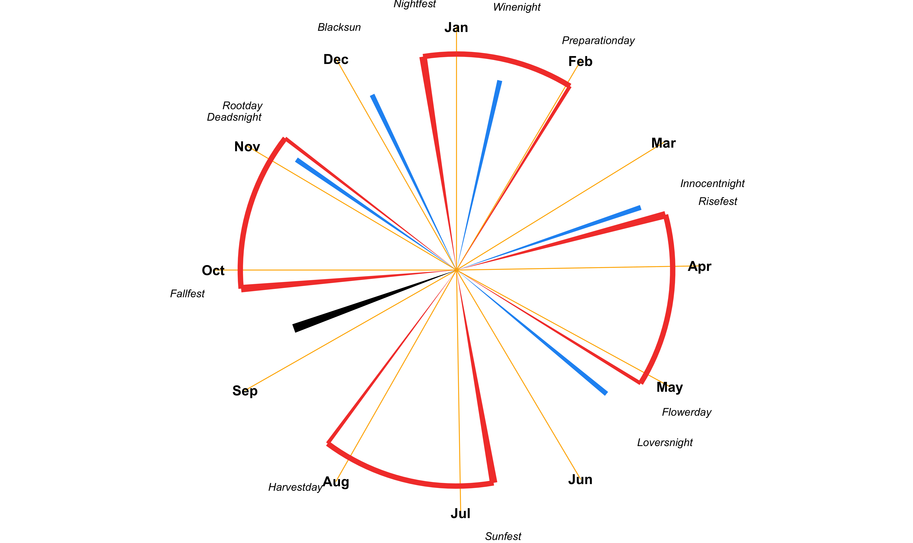

# Calendar

We are in **Summer**. The **Bright Days** are upon us, and we are in the
time of the **Rise**. The next celebration is
[**Fallfest**](https://github.com/RealityBending/Calendar#Fallfest) in
**23** days.

## Important dates

None yet.

## Celebrations

<!-- -->

In the Reality Bending group, we follow the calendar of the
heosphorists. The year is divided in two main overlapping cycles, the
**Rise/Fall** phases (December - June) and the **Dark nights/Bright
days** periods (September - March).

*Note: this calendar is automatically updated daily, taking into account
the exact dates of the solar and lunar astronomical events (solstices,
equinoxes, full moons) of the current year.*

### Preparationday

**Fullmoon between Risefest and Sunfest** *(2022 February 16 -
Wednesday)*. Team building and planning of the work roadmap for the
year.

### Sunfest

**Spring equinox** *(2022 March 20 - Sunday)*. Eating eggs and water
pranks. Coming of **Bright days** and **Spring**.

### Loversnight

**Fullmoon between Sunfest and Fallfest** *(2022 May 15 - Sunday
night)*. Celebration of partners and loved ones.

### Lifesday

**Day after Loversnight** *(2022 May 16 - Monday)*. Visit to parents and
family. Start of **Summer**.

### Fallfest

**Summer solstice** *(2022 June 21 - Tuesday)*. Crackers and fireworks
at sunset. Popcorns made in fires in the night.

### Thanksday

**Fullmoon between Fallfest and Moonfest** *(2022 August 12 - Friday)*.
Work superiors treat to dinner. Rewards and vacations.

### Moonfest

**Autumn equinox** *(2022 September 23 - Friday)*. Fires are lit (no
electricity). Coming of the **Dark Nights** and **Autumn**.

### Harvestday

**Day before the fullmoon between Moonfest and Risefest** *(2022
November 08 - Tuesday)*. Physical/sport games and competitions between
colleagues.

### Deadsnight

**Fullmoon between Moonfest and Risefest** *(2022 November 08 -
Tuesday)*. Visit to cemeteries. Start of **Winter**.

### Risefest

**Winter solstice** *(2022 December 21 - Wednesday)*. From that date
until the 6th January, people keep a tree inside of their houses. On the
21th, it is decorated with garlands, and people drink snake wine.
